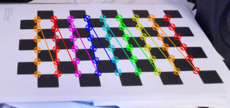
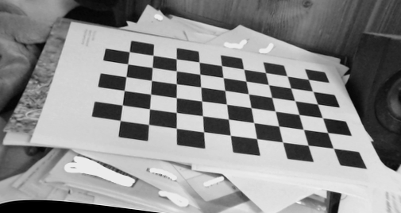

# Project paths most walked

This github repo contains the base code for the aforementionned project, and is a working if minimal exemple of how everything works.

The full objective of the project was to use a set of camera to determine the position of peoples in a picture and use said position to update a projection on the ground, makink paths appear or disappear depending on the traffic in a certain area.

The projection is made using a projector and a 3d scene created in unreal engine 5. While this specific repo doesn't contain any UE files, you may use the below link to find the repo that does. (https://github.com/Eteroclia/Project_paths_most_walked_UE/tree/75ae7f28ff1886abe50a8051ebf0ec8a4f273d14)

# The workings of the project

I will now explain the different parts of the code used in the final exemple. Please note that this repo was never meant to be a final working product and may as such contain less than ideal structures and configurations.

Please also note that all images manipulations and displays are made using the OpenCV library in it's most basic form, leading to a lack of usability due to the lib limited capabilities in therm of GUI design.

## The basics

For the uninitiated, it may seems like using a camera is as simple as plugging it in and using the raw output as data. This approach however ignores a really important fact of life, that is the distortion introduced in an image due to non perfect lenses. In other words, while it may seems like the picture is perfectly accurate to real life, the truth is that, should you take a picture of two straights lines, the will not remain so in the images.

These distortions may be unvisible to the naked eye, at least without using a fisheye type lens, but are important when it comes to comparing the outputs of two cameras, such as what we do in this project.

We can then "compare" the two cameras images, and use keypoints recognition to determine the distance beetween an object and the cameras, thus achieving our people detetcion.

## Images corrections

As the cameras deform reality, we can mesure and undo the transformation by first taking pictures of a known pattern, here a checkboard.

The advantage of using one such a pattern are threefold. Firstly, the multiple straight lines borne of the color alternance are easy to detect, as is any deviation. Secondly, the junction between white and black forms another easy to detect point, the so called keypoints (in truth, the lines are not so much detected as inferred using these points). Lastly, due to the pattern having a known size, the distance from the cameras, as well as between them can be calculated.

To rectify the images, we thus take multiple pictures of the same pattern in different position with the two camera at the same time. Naturally, both camera need to see the pattern in full for the operation to work. In this project, this is achieved using the imagesTaker.cpp file. The images are then stored in the images folder, with an information as to wich camera produced wich image.

You can see here the result of the board detection.

Once the images are saved, they need to be moved in the correct file between "images_cal_cam_left" and "images_cal_cam_right". Once this is done, the code in stereo_calib.cpp will take these images and compute the stereo rectification map for both camera at once and save it as "stereo_rectify_maps.xml" in the "data" folder. From then on, there is no need to do these two parts again as long as the camera setup remains undisturbed. Please note that even a small movement may be enough to change everything however.

Here is an undistorded image result. The significant visible distorition is due to the lack of planicity in the picture.

## Depth detection

We can now finally go on to the depth detection part of the project. In essence, this part is also relatively straight forward in theory. Just like we can use both of our eyes to detect depth, so can we use two cameras to do the same. We simply need to take both of the undistorded pictures, and once again detect specific corresponding points between them. We can then compute their differences in position using the known distance between the cameras, and we obtain what is called a disparity map. Flat and far away objects will have a weak disparity, will closer or textured object will have a more important disparity. We can the simply use the value of said disparity to approximate the distance of an object. We can the simply threshold the result and use that as a depth map.

You can see here that the stuffed pandas' head's side is very visible, while the thing behind it, namely a wall, is less so. The for this part is in the depthTest.cpp file.

## Objects detection

We now have our depth picture, but we still need to detect the peoples in it. To do so, we will use OpenCV's function to detect contours. By feeding it our depth map, we can obtain the contours of every object in the picture, with said object appearing as a unicolor blob if our disparity is calibrated correctly. By calculating the size of the contours, we can the remove the ones wich are too small to be of import. Then, we can use another OpenCV function to obtain the bounding rectangles of the shapes of interest and voila! We now have detected the peoples in the field of view of our cameras.

# Usage of the code

This code is compilated using CMake, using the "cmake --build .\cmakeOut" command. This will use the configuration written in the "CMakeLists.txt" file to compile and output three exe files in "cmakeOut/debug".

The first file you will want to use is "ImagesTaker.exe". It will open your computer's first two connected cameras, meaning it will use the integrated webcam should you have one. This can easily be changed by changing the numbers in line 9. Once the window is opened, you can save the images by pressing "s" on your keyboard, and close the window by pressing "q". The images are outputted in the "images" folder, and should be moved manually to the corresponding "images_cal_cam_*" folder.

Next is "Calibation.exe". This one create the rectification matrixes of the cameras. It will show the result of the checkerboard finding function for each image, and pressing any key will go to the next one. Once done, the result are saved in "data\stereo_rectify_maps.xml".

Finally is "DepthDetect.exe". Like before, this will open the first two camera the program sees. This can be changed in lines 234 and 235. Once launched, a window containing the disparity map and the associated tuning sliders, a window containing the depth map and a window containing the detected obstacles will appear. The parameters can be changed in the disparity windows but are not saved upon quitting. The windows can be closed using the "esc" key on the keyboard.

# Other files

The other files in this repo are legacy and of little use as is, but can be usefull for referencing. The "ueIntegration.h" file contain the final code in a more modular form, and is the basis for unreal engine integration.

# UE integration

As said before, the initial objective was to have a fully functionnal UE project using this code to produce a nice little representation of where people walked the most. Unfortunatly, UE has seen fit to fight against me at litterally every steps, and I have as such decided to abandon the integration. Should you wish to see the current state of things, please feel free to use the link provided at the start, but beware the fact no explanation will be forthcoming for this part. 

# Usefull links

Should you want to learn more on the subject of disparity/depth detction suing a stero camera setup, here are the links to my sources.

https://learnopencv.com/making-a-low-cost-stereo-camera-using-opencv/
https://github.com/spmallick/learnopencv/blob/master/Depth-Perception-Using-Stereo-Camera/cpp/obstacle_avoidance.cpp
https://learnopencv.com/depth-perception-using-stereo-camera-python-c/
https://docs.opencv.org/3.4/d3/d14/tutorial_ximgproc_disparity_filtering.html

More links may be hidden in the various files of the project as well.